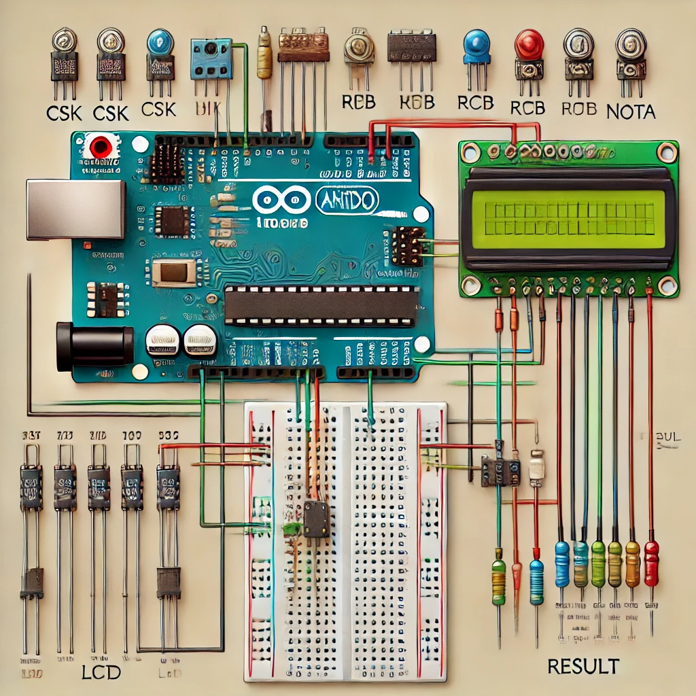

# Electronic Voting Machine

This project is an Arduino-based electronic voting machine using an LCD display and buttons. Users can cast their vote for one of the predefined options (e.g., IPL teams), and the system will display the results after voting is completed.

## Components Used:
- Arduino Uno (or similar)
- Breadboard
- 5 Push Buttons (labeled CSK, MI, RCB, NOTA, RESULT)
- LED (for vote casting indication)
- 16x2 LCD Display
- Resistors (for buttons and LED, usually 220Ω for LED and 10kΩ for buttons)
- Jumper Wires

## How to Set Up:
1. Connect the components according to the circuit diagram and connection.
2. Upload the provided `EVM_CODE.ino` file to your Arduino board.
3. Power the Arduino and interact with the buttons to cast votes.

## Wiring Steps:
Wiring Steps:
1. LCD Connections:
   - RS pin to Arduino Pin 11
   - EN pin to Arduino Pin 10
   - D4 pin to Arduino Pin 9
   - D5 pin to Arduino Pin 8
   - D6 pin to Arduino Pin 7
   - D7 pin to Arduino Pin 6
   - VSS to Ground
   - VDD to 5V
   - V0 (Contrast) connected via a 10kΩ potentiometer between Ground and 5V
   - A (Anode) to 5V through a 220Ω resistor (for backlight)
   - K (Cathode) to Ground

2. Buttons:
   - Connect one terminal of each button to Pins A0, A1, A2, A3, A4 respectively on the Arduino for CSK, MI, RCB, NOTA, RESULT.
   - The other terminal of each button goes to Ground.
   - Place a 10kΩ pull-down resistor between each button pin and Ground to prevent floating values.

3. LED:
   - Cathode to Ground.
   - Anode to a 220Ω resistor and then to Pin 13 of the Arduino.

4. Power Supply:
   - 5V and Ground from the Arduino to the breadboard’s power rails.

## How It Works:
- **Buttons 1-4:** Used to cast votes for different teams.
- **Button 5:** Displays the results.
- The system counts votes and declares the winner.

## Circuit Diagram:

## Demonstration
https://drive.google.com/file/d/1c2DO_n-r4_CKE5GJKLmkRCz6ZoybZR58/view?usp=sharing

## Made by-Kedar Singh
